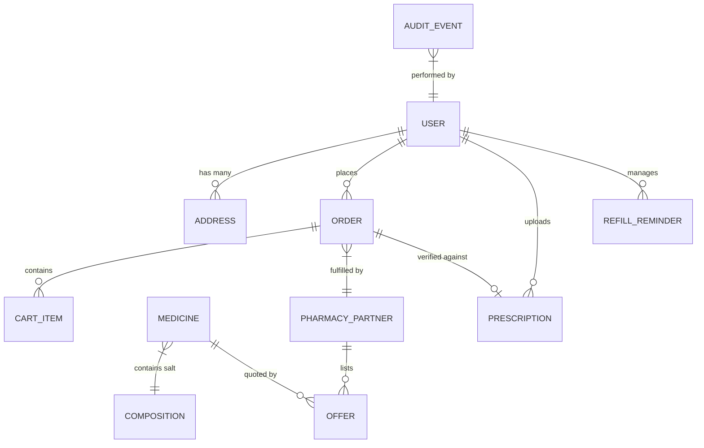
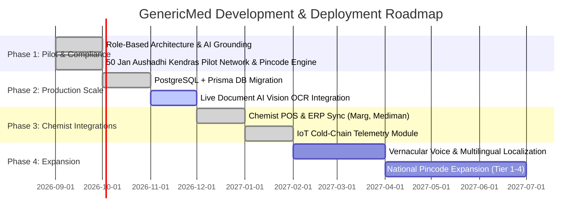

# GenericMed - Persistent Long-Term Memory

> **System Notice:** This document serves as the permanent, authoritative knowledge base for the **GenericMed** platform. AI coding assistants should consult this document to understand the system architecture, business rules, current implementation state, and immediate roadmap before proposing code changes.

---

## 1. Project Overview

**GenericMed** is an Indian pharmaceutical e-commerce and regulatory compliance marketplace designed to solve three structural problems in the Indian healthcare supply chain:

1. **Massive Drug Price Inflation:** Branded formulations often trade at a 300% to 850% markup over identical chemical salts manufactured under Indian Pharmacopoeia (IP) standards.
2. **Deceptive E-Commerce Pricing:** Platforms advertise unrealistically low drug rates but add unexpected doorstep delivery charges, packaging fees, and convenience taxes during final payment checkout.
3. **Regulatory Non-Compliance & Safety Gaps:** Dispensing Schedule H and H1 medicines without strict verification by a licensed registered pharmacist (Rule 65, Drugs and Cosmetics Rules, 1945) poses legal and clinical hazards.

GenericMed connects verified patients directly with licensed retail chemists (Form 20B/21B) and government-backed **Pradhan Mantri Bhartiya Janaushadhi Kendras (PMBJK)**. It features a transparent total-payable cost comparison engine, automated prescription OCR parsing, a dedicated registered pharmacist sign-off queue, D3-powered regional logistics density monitoring, and an immutable audit log system.

---

## 2. Tech Stack & Infrastructure

| Layer | Technologies & Libraries | Version | Purpose / Responsibilities |
| :--- | :--- | :--- | :--- |
| **Frontend Core** | React | `^19.0.1` | Component lifecycle, concurrent rendering, dynamic views |
| **Type System** | TypeScript | `~5.8.2` | Compile-time validation across all domain schemas |
| **Build & Bundler** | Vite | `^6.2.3` | Ultra-fast HMR, ES module serving, static bundling |
| **Backend Server** | Node.js + Express | `^4.21.2` | REST endpoints, Vite dev middleware, static asset serving |
| **Execution Tooling** | `tsx` | `^4.21.0` | Direct TypeScript execution for server without manual compile |
| **CSS & Styling** | Tailwind CSS (v4) | `^4.1.14` | High-performance CSS engine via `@tailwindcss/vite` |
| **AI & Grounding** | Google Gen AI SDK | `^2.4.0` | `@google/genai` with `gemini-3.5-flash` & Google Maps Grounding |
| **Visualization** | D3.js | `^7.9.0` | SVG coordinate rendering, color scales, delivery heatmaps |
| **Micro-Animations** | Motion (Framer) | `^12.23.24` | Layout transitions, modals, order timeline progress pulses |
| **Icons** | Lucide React | `^0.546.0` | Consistent, accessible clinical and interface iconography |
| **Markdown Parser** | React Markdown | `^10.1.0` | Rendering AI logistics insights and PRD documentation |

---

## 3. Features Completed & Functional Status

### A. Patient / Customer Experience (`customer` role)
- [x] **Zero-Markup Search & Salt Auto-Complete:** Search by popular brand names (e.g. *Dolo 650*, *Glycomet 500*, *Augmentin 625*) or exact chemical molecules (*Paracetamol*, *Metformin Hydrochloride*, *Amoxicillin + Clavulanic Acid*).
- [x] **Verified Total-Payable Cost Engine:** Real-time breakdown of Base Price + Doorstep Courier Fee + Packaging Charge + GST vs. Standard Branded MRP, highlighting savings up to 85%.
- [x] **Digital Prescription Upload & Mock OCR:** Multi-file image upload with instant simulated OCR extraction of doctor details, council registration numbers, drug salts, and durations.
- [x] **Transparent Cart & Checkout Modal:** Clear fee breakdown, pincode serviceability validation, and payment method selection (UPI, NetBanking, Card, Cash on Delivery).
- [x] **Multi-Stage Order Fulfillment Tracker:** Real-time progress tracker with tracking IDs and milestone timeline (Order Placed $\rightarrow$ Rx Verification $\rightarrow$ Pharmacy Processing $\rightarrow$ Dispatched $\rightarrow$ Delivered).
- [x] **Digital Tax Invoice Modal:** CDSCO & GSTIN-compliant digital receipt generation displaying partner chemist drug license number (Form 20B/21B), batch numbers, and expiry dates.
- [x] **30-Day Chronic Refill Manager:** Automated countdown for chronic medicines (Metformin, Telmisartan, Atorvastatin) with 1-click reordering capability.

### B. Pharmacist Verification Portal (`pharmacist` role)
- [x] **Dedicated Verification Queue:** Filterable queue of incoming patient prescriptions (`Pending Review`, `Verified`, `Rejected`, `Clarification Requested`).
- [x] **Doctor Council Registration Validation:** Displays prescribing physician name, clinic address, and State Medical Council registration ID.
- [x] **Clinical Decision Actions:**
  - `Approve`: Automatically updates associated orders to `Pharmacy Processing` and affixes registered pharmacist license sign-off.
  - `Reject`: Requires clinical reason entry (e.g. invalid date, unreadable dosage, banned formulation) and alerts customer.
  - `Clarification Requested`: Direct query mechanism to prescribing clinic/customer.

### C. Licensed Chemist Partner Portal (`partner` role)
- [x] **Pharmacy Inventory Management:** Live partner switcher (e.g., *Jan Aushadhi Kendra Bandra*, *Apollo Pharmacy Hub*, *Wellness Forever Chemist*).
- [x] **Stock State & Freshness Controller:** Instant toggling of inventory counts (`In Stock`, `Low Stock`, `Out of Stock`) and automated timestamping.
- [x] **Price Adjustment Engine:** Real-time adjustment of base generic prices and delivery surcharges.
- [x] **Order Packing & Dispatch Console:** Direct packing verification with batch number verification and courier handover.

### D. Regulatory & Audit Cockpit (`admin` role)
- [x] **Immutable Tamper-Evident Audit Trail (FR-ADM-04):** Comprehensive tabular log of all platform activities with filtering by action category, actor name, and role.
- [x] **JSON Audit Export:** 1-click export of system audit records for statutory inspection by State Drug Inspectors.

### E. AI Logistics & Grounding Intelligence
- [x] **Regional Delivery Heatmap (D3.js):** Geographic delivery corridor density across Indian metropolitan and tier-2 clusters (Mumbai, Delhi-NCR, Bengaluru, Pune, Hyderabad, Chennai).
- [x] **Peak Hours Transit Heatmap:** Analysis of OPD clinic release congestion corridors (10:00–13:00 and 17:00–21:00) impacting delivery SLAs.
- [x] **Google Maps Grounded Logistics Intel (`/api/regional-logistics-intel`):** Calls `gemini-3.5-flash` with Google Maps tool to ground local Jan Aushadhi Kendras, hospital dispatch counters, and cold-chain hubs. Includes offline fallback links.

### F. Authentication & Identity
- [x] **Multi-Persona Role-Based Gateway (`auth` role & modal):** Dedicated login and registration screens for Customers, Registered Pharmacists, Chemist Partners, and Audit Officers with `localStorage` session persistence.

### I. Phase 3 Chemist POS/ERP Sync & IoT Cold-Chain Telemetry
- [x] **ERP / POS Bidirectional Sync (`ErpSyncView.tsx`):** Connector panel supporting Marg ERP 9.9, Mediman 4.2, POSibolt 3.1, Vyapar 17.4. Live sync state badges, auto-sync toggle, simulate webhook, per-partner webhook log. Wired as `ERP / POS Sync` tab inside Chemist Partner Portal.
- [x] **IoT Cold-Chain Telemetry Monitor (`ColdChainMonitorView.tsx`):** 6 BLE/Cellular/WiFi sensors across 5 metro clusters. D3.js 48-hour temperature timeline (safe-zone band, breach markers, catmull-rom spline). Alert acknowledgement flow. CDSCO Schedule M downloadable compliance certificate. Wired as `Cold-Chain IoT` tab in both Partner Portal and Admin Cockpit.
- [x] **Phase 3 Backend API Surface:** 11 new routes for ERP webhook ingestion, sync status, sensor readings, alert management, and breach notification (`POST /api/cold-chain/alert` auto-creates alerts and updates live sensor state).

### H. Phase 2 PostgreSQL + Prisma DB Migration
- [x] **Dual-Persistence Repository Layer (`server/db.ts`):** All data access functions (medicines, offers, partners, prescriptions, orders, audit events) attempt PostgreSQL via Prisma first, then transparently fall back to in-memory seed state. Zero UI regressions in offline mode.
- [x] **Full REST API Surface (`server.ts`):** 15 endpoints covering all domain entities — medicines, offers, stock updates, partners, prescriptions, pharmacist reviews, orders, audit events, DB health check, and seeding.
- [x] **API-Hydrated Frontend (`App.tsx`):** `bootstrapData()` runs on mount via `useEffect`, calling all 6 read endpoints with `Promise.allSettled`. State is hydrated from the API if data is present; in-memory seeds remain as warm fallback.
- [x] **Write-Through API Persistence:** Order creation, audit event logging, offer stock updates, and prescription reviews are all fire-and-forget PATCHed / POSTed to the backend in addition to updating local React state.
- [x] **Database Status Badge (`AdminAuditView.tsx`):** Live `/api/db-status` badge in the Admin Cockpit displays provider mode (PostgreSQL / in-memory), connection latency, and entity counts.

### G. Phase 1 National Pilot Network & Pincode Engine
- [x] **50-Kendra Pilot Network Across 5 Healthcare Clusters:** 32 PM Jan Aushadhi Kendras + 18 retail chemists with verified Form 20B/21B licenses and state GSTINs across Mumbai MMR, Pune, Delhi NCR, Bengaluru, and Hyderabad.
- [x] **National Pincode Serviceability & Discovery Engine (`PincodeServiceabilityModal.tsx`):** Postal resolver with real-time SLA calculation, cold-chain readiness, and nearby store density.
- [x] **Pincode-Aware Proximity Offer Ranking:** Automatically prioritizes local Jan Aushadhi Kendras matching the user's delivery pincode.
- [x] **Partner Multi-Store Grouped Selector:** Grouped `<optgroup>` store selector in the partner portal enabling seamless inventory management across all 50 stores.
- [x] **Phase 1 Pilot Performance & Statutory Compliance KPI Cockpit (`PilotMetricsView.tsx`):** Real-time monitoring of 5 pilot KPIs (50/50 onboarded, 98.4% cold-chain, 32.8 min delivery SLA, ₹15.48L savings, 11.4 min Rx review turnaround).

---

## 4. Pending Features & Product Backlog

- [x] **Chemist POS / ERP Webhook Sync:** Bidirectional inventory synchronization with Marg ERP, Mediman, POSibolt, and Vyapar via webhook API.
- [x] **IoT Cold-Chain Telemetry:** Integration with BLE/cellular temperature sensor loggers ensuring biological items (Insulin, Vaccines) remain between 2°C and 8°C throughout transit. CDSCO Schedule M compliance certificates generated per shipment.
- [ ] **Real OCR via Vision AI:** Replace simulated OCR parsing with Google Cloud Document AI / Gemini Vision API for messy handwritten Indian prescriptions.
- [ ] **Automated WhatsApp / SMS OTP Gateway:** Notification updates via WhatsApp Business API for prescription approval and delivery milestones.
- [ ] **Direct Payment Gateway Integration:** Razorpay / Cashfree native UPI intent and auto-debit subscriptions for monthly chronic refills.
- [x] **Multilingual Vernacular Support:** 7-language i18n engine (English, Hindi, Marathi, Tamil, Telugu, Kannada, Bengali) with `VernacularSwitcher` in Header, `LocaleProvider` context, and translations applied across hero, search, categories, and medicine card (Phase 4).

---

## 5. API Endpoints Specification

### Express Server Routes (`server.ts`)

#### 1. `GET /api/health`
- **Purpose:** Server health and uptime verification.
- **Request:** None
- **Response:**
  ```json
  {
    "status": "ok",
    "timestamp": "2026-09-08T09:25:00.000Z"
  }
  ```

#### 2. `POST /api/regional-logistics-intel`
- **Purpose:** Fetches AI-synthesized regional logistics intelligence grounded with real Google Maps data.
- **Headers:** `Content-Type: application/json`
- **Request Body:**
  ```json
  {
    "regionName": "Bandra West, Mumbai",
    "state": "Maharashtra",
    "latitude": 19.0596,
    "longitude": 72.8295,
    "queryType": "pharmacy_network"
  }
  ```
- **Response (Google Maps Grounded):**
  ```json
  {
    "source": "google-maps-grounded",
    "insights": "Regional logistics assessment with verified Jan Aushadhi Kendras...",
    "groundingLinks": [
      {
        "title": "Jan Aushadhi Kendra - Bandra West",
        "uri": "https://maps.google.com/?cid=...",
        "reviewSnippet": "All generic substitutes available at subsidized rates."
      }
    ],
    "location": {
      "latitude": 19.0596,
      "longitude": 72.8295,
      "regionName": "Bandra West, Mumbai"
    }
  }
  ```
- **Response (Offline / No Key Fallback):**
  ```json
  {
    "source": "fallback",
    "insights": "**Bandra West Logistics Overview**: High delivery corridor with multiple verified Jan Aushadhi Kendras...",
    "groundingLinks": [
      {
        "title": "Pradhan Mantri Bhartiya Janaushadhi Pariyojana Kendra (Bandra West)",
        "uri": "https://www.google.com/maps/search/Jan+Aushadhi+Kendra+Bandra+West+Maharashtra"
      }
    ],
    "location": { "latitude": 19.0596, "longitude": 72.8295, "regionName": "Bandra West, Mumbai" }
  }
  ```

#### 3. `GET /api/db-status`
- **Purpose:** Real-time PostgreSQL connectivity health check with latency and entity counts.
- **Request:** None
- **Response:**
  ```json
  {
    "isConnected": true,
    "provider": "postgresql",
    "latencyMs": 4,
    "lastChecked": "2026-09-09T10:00:00.000Z",
    "counts": {
      "pharmacyPartners": 50,
      "medicines": 12,
      "offers": 120,
      "orders": 5,
      "auditEvents": 42
    }
  }
  ```
- **Fallback (no DB):** `"provider": "in-memory-fallback"`, `"isConnected": false`.

#### 4. `POST /api/db-seed`
- **Purpose:** Seeds / re-seeds the PostgreSQL database from domain mock data via Prisma upserts.
- **Response:** `{ "success": true, "message": "...", "counts": { ... } }`

#### 5. `GET /api/medicines`
- **Query Params:** `q` (text search), `schedule` (e.g. `Schedule H`)
- **Response:** `{ "medicines": [...] }`

#### 6. `GET /api/medicines/:id`
- **Response:** `{ "medicine": { ... } }` or 404.

#### 7. `GET /api/partners`
- **Query Params:** `city`, `pincode`
- **Response:** `{ "partners": [...] }`

#### 8. `GET /api/offers`
- **Query Params:** `medicineId`, `pincode` (triggers proximity ranking)
- **Response:** `{ "offers": [...] }`

#### 9. `PATCH /api/offers/:id/stock`
- **Body:** `{ "stockState": "Low Stock", "stockCount": 12, "batchNumber": "BT-2026-99", "expiryDate": "08/2028" }`
- **Response:** `{ "offer": { ... } }`

#### 10. `GET /api/prescriptions`
- **Query Params:** `status` (e.g. `Pending Review`)
- **Response:** `{ "prescriptions": [...] }`

#### 11. `PATCH /api/prescriptions/:id/review`
- **Body:** `{ "status": "Verified", "notes": "...", "reviewedBy": "Sneha Patil, Reg #PH-MH-98214" }`
- **Response:** `{ "prescription": { ... } }`

#### 12. `GET /api/orders`
- **Query Params:** `userId`
- **Response:** `{ "orders": [...] }`

#### 13. `POST /api/orders`
- **Body:** `{ "order": { ...Order } }`
- **Response:** `{ "order": { ... } }` (201)

#### 14. `GET /api/audit-events`
- **Query Params:** `limit` (default 200)
- **Response:** `{ "events": [...] }`

#### 15. `POST /api/audit-events`
- **Body:** `{ "event": { ...AuditEvent } }`
- **Response:** `{ "event": { ... } }` (201)


Defined authoritatively in `src/types.ts`:



### Entity Specifications

1. **`UserProfile`:** User identity, role (`customer | pharmacist | partner | admin | auth`), phone, email, default pincode, GSTIN, pharmacy license number, and council registration number.
2. **`Medicine`:** Product catalog entity:
   - `id`: Unique identifier (e.g. `med-paracetamol-650`).
   - `name`: Generic formulation name.
   - `composition`: Active chemical salt (e.g. `Paracetamol 650mg IP`).
   - `dosageForm`: `Tablet | Capsule | Syrup | Injection | Inhaler | Ointment`.
   - `isGeneric`: Boolean flag.
   - `scheduleCategory`: `Schedule H | Schedule H1 | OTC | Schedule X`.
   - `requiresPrescription`: Boolean flag.
   - `brandedAlternativeName`: Reference branded medicine (e.g. `Dolo 650`, `Calpol 650`).
   - `brandedMrp`: Market price of branded equivalent.
   - `genericMrp`: Base Maximum Retail Price of generic equivalent.
3. **`PharmacyPartner`:** Retail chemist or Kendra entity:
   - `id`: Partner identifier (e.g. `partner-pmbjk-01`).
   - `name`: Chemist business name.
   - `licenseNumber`: Form 20B/21B statutory drug license string.
   - `gstin`: 15-character GSTIN.
   - `isJanAushadhiKendra`: Boolean flag indicating government scheme affiliation.
   - `verifiedBadge`: Statutory verification status.
4. **`Offer`:** Specific stock quote from a partner chemist:
   - `basePrice`, `deliveryFee`, `packagingFee`, `gstPercent`.
   - `totalPayableCost`: Exact calculated checkout cost.
   - `savingsVsBranded`, `savingsPercent`.
   - `stockState`: `'In Stock' | 'Low Stock' | 'Out of Stock' | 'Stale'`.
   - `batchNumber`, `expiryDate`.
5. **`Prescription`:** Digital Rx entity:
   - `userId`, `fileName`, `uploadedAt`, `status`.
   - `doctorName`, `doctorRegNo`, `clinicName`.
   - `extractedMedicines`: Array of `{ name, dosage, duration, verified }`.
   - `reviewerNotes`, `reviewedBy`, `reviewedAt`.
6. **`Order`:** Transaction and fulfillment record:
   - `orderNumber`, `items`, `totalPayable`, `deliveryAddress`, `paymentMethod`, `paymentStatus`.
   - `fulfillmentStatus`: `'Order Placed' | 'Rx Verification' | 'Pharmacy Processing' | 'Dispatched' | 'Out for Delivery' | 'Delivered' | 'Cancelled'`.
   - `timeline`: Chronological progression log.
   - `invoiceNumber`, `trackingNumber`.
7. **`AuditEvent`:** Statutory tamper-evident compliance log:
   - `id`, `timestamp`, `actor`, `role`, `action`, `entity`, `entityId`, `details`.

---

## 7. Important Business Logic & Invariants

### A. Total Payable Cost & Savings Formula
$$\text{Total Payable} = \text{Offer Base Price} + \text{Delivery Fee} + \text{Packaging Fee} + \left(\text{Base Price} \times \frac{\text{GST \%}}{100}\right)$$
$$\text{Savings Amount} = \text{Branded MRP} - \text{Total Payable}$$
$$\text{Savings Percentage} = \left(\frac{\text{Savings Amount}}{\text{Branded MRP}}\right) \times 100$$

### B. Prescription Verification State Machine
```
[Uploaded] ---> [Pending Review]
                     |
        +------------+------------+
        |                         |
  (Pharmacist               (Pharmacist
   Approves)                 Rejects)
        |                         |
        v                         v
   [Verified]                [Rejected]
        |
        +--> Orders advance from "Rx Verification" to "Pharmacy Processing"
```

### C. Schedule Compliance Checks
- If any cart item contains `requiresPrescription === true` or `scheduleCategory !== 'OTC'`, the order checkout enforces valid `prescriptionId` attachment.
- Schedule X items trigger a regulatory restriction alert requiring tripartite paper documentation before physical dispatch.

---

## 8. Known Issues & Technical Considerations

1. **Simulated Prescription OCR:** The client-side mock currently parses mocked medicine rows; real production deployment requires hooking into a live document vision pipeline.
2. **In-Memory Volatility:** Changes made to orders, inventory stock, or prescriptions reset to default seed data if the browser cache is purged. (User profile and active role persist in `localStorage`).
3. **Environment Variable Dependency:** When `GEMINI_API_KEY` is not present in `.env`, the backend falls back to regional search URLs. To test live Maps Grounding, set a valid key in `.env`.

---

## 9. Future Roadmap


